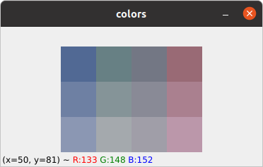

# Prototype: Game Piece Detection

This prototype is a proof of concept project to detect game pieces. 
It is dual purpose and also serves the purpose of training the Haar Cascade classifier, should it be used in the main source.

## Setup

The setup of the detection tool is the same as the main project. See the main [README.md](../../README.md)

## Collection Scripts
The available scripts for data collection are run using:

| Script            | Command                        |
|-------------------|--------------------------------|
| collect           | `poetry run collect`           |
| combine_positives | `poetry run combine_positives` |

### Collect Samples
To collect data, run the collect script. 
The type of sample collected and name is defined in `src/training/collect/collect_dataset.py`
Samples are stored in `data/<sample_type/<sample_key>`
A list of the samples and any parameters are listed in the same directory.

### Combine Positive Samples
To create a descriptor file that includes all positive samples, use this script.
The combined data descriptor file is placed in `data`

## Training
### Prerequisites
* [Docker](https://www.docker.com/)

### Training
A Dockerfile is used to train the classifier. BuildKit is required.
```shell
sudo chmod 666 /var/run/docker.sock
DOCKER_BUILDKIT=1 docker build --build-arg COLOR={PIECE_COLOR} --file Dockerfile --output type=local,dest=training/ .
```

`PIECE_COLOR` is `combined` for the combined dataset. 

The Dockerfile includes the parameters used to train the model.

The XML model is output into `training`.

## Detection
The available scripts for token detection are run using:

| Script            | Command                        |
|-------------------|--------------------------------|
| detect_color      | `poetry run detect_color`      |
| find_threshold    | `poetry run find_threshold`    |
| detect            | `poetry run detect`            |

### Token Piece Detection
From the experimental training runs, the best model is used: `training/combined_experiment_7/cascade.xml`.

The script uses the camera (id=0). It also implements a simple board detection algorithm, finding the board
based on a colour threshold value. 

Tokens are not labelled in the output.

### Token Colour Detection
This script calculates BGR values from the collected dataset. 

The original dataset gave these results:

| color    | lower           | average         | higher          |
|----------|-----------------|-----------------|-----------------|
| blue     | (148, 105, 81)  | (163, 128, 110) | (179, 151, 139) |
| green    | (132, 128, 103) | (152, 148, 133) | (173, 169, 164) |
| purple   | (132, 119, 115) | (150, 138, 137) | (168, 158, 160) |
| red      | (117, 106, 153) | (143, 128, 170) | (170, 151, 187) |

This image shows the minimum and maximum range of the dataset's colours, and the average colour:



#### Finding the Threshold
The colours are detected by filtering out the background based on a threshold. 
This value is set in `src/detect_color.py`
The average of the remaining pixel colours is calculated.

The Threshold finding script can be used to visually find the best value for the threshold. 
Running the script loops between the collected dataset and applies a filter. 
The value of the threshold is printed in STDOUT and is varied with the A and D keys. 
The threshold can be between 0 and 255.

To exit, hold the ESC key.

#### Color Detection Results:

Threshold: Approximately 200/255 still seems to be good as a binary threshold based on the data for training.

To calculate the colour:
Using dominant color in the image seems to not have much impact on 
average color as the image contains only the colour of the board and the token. 
Best results come from the average color with black pixels omitted after the threshold filter.

